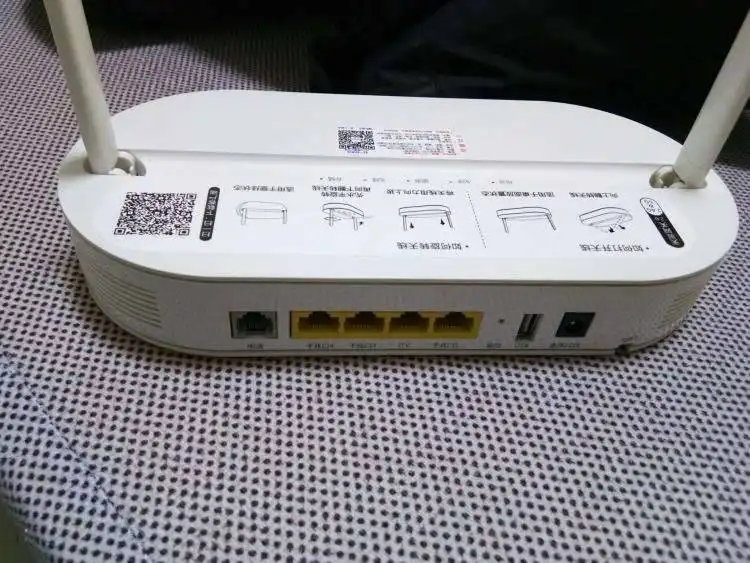
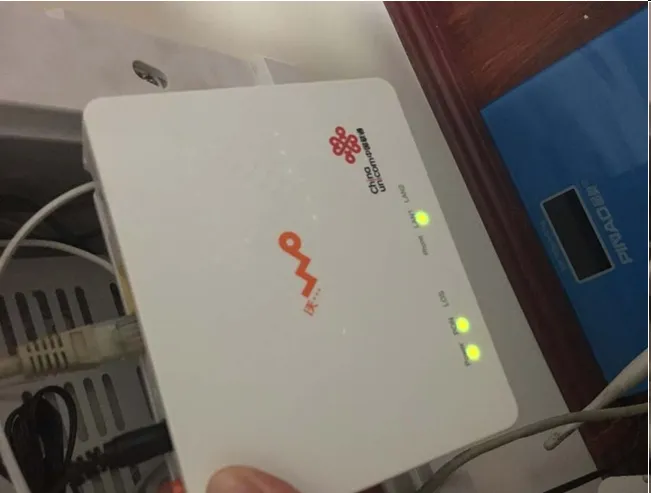
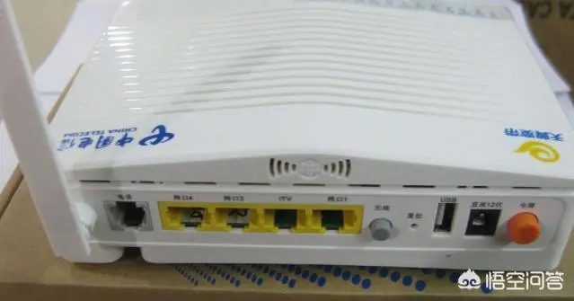
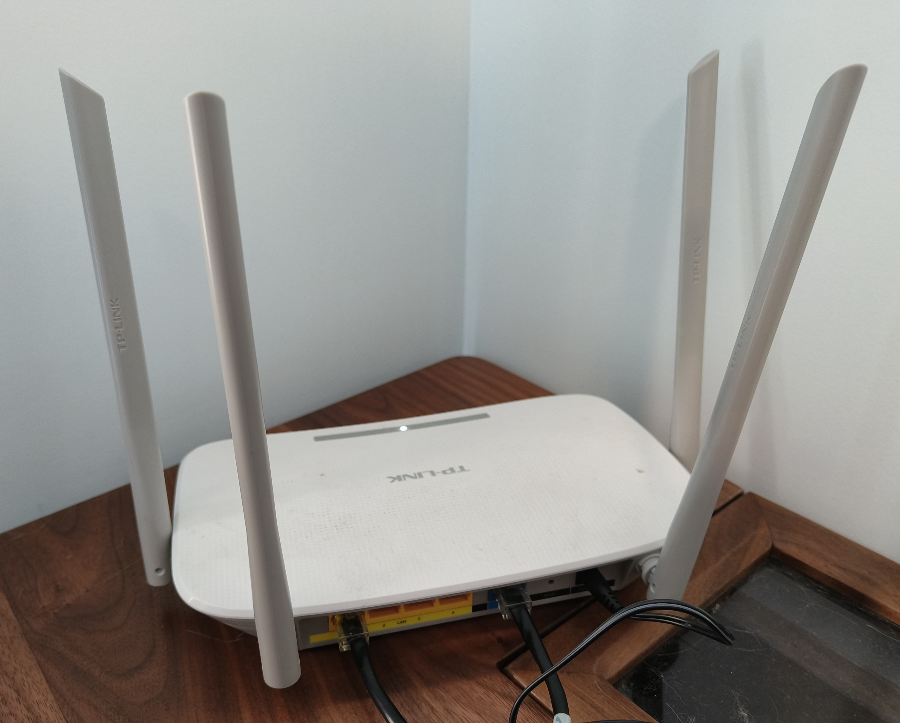
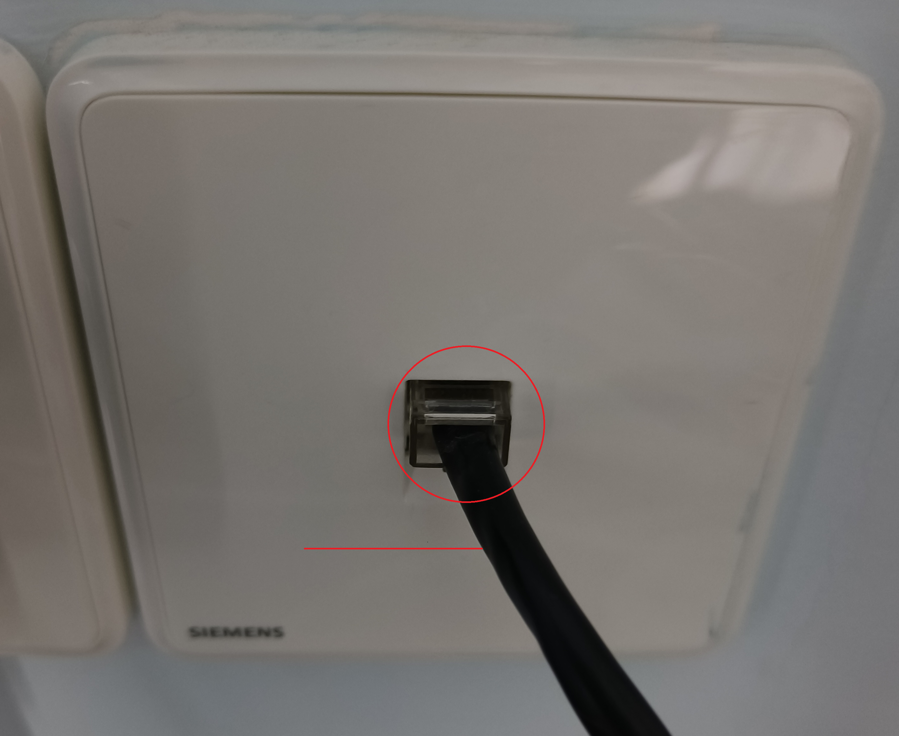
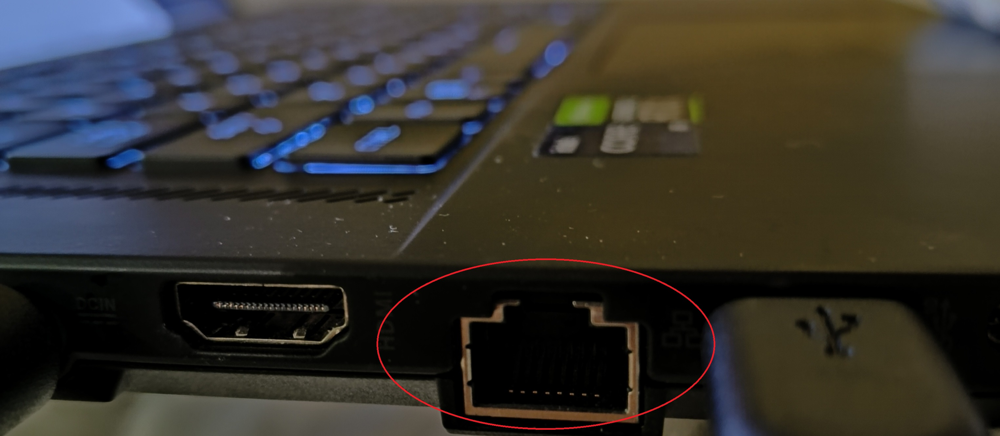
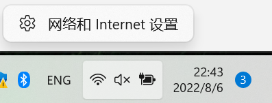
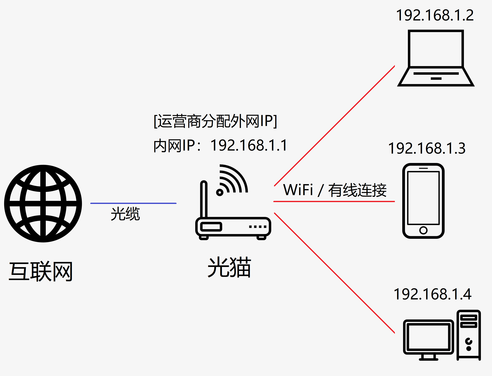

# 服务器搭建教程

我成功的在家中搭建了一台网络服务器，使得我能用一个特定的域名访问在家中24/7运行的一台服务器，从而访问家中的文件(建NAS，私有云)，通过HTTP文件服务器和同学分享大文件，作为高性能的远程云电脑，或是作为我的世界， 泰拉瑞亚， 铁锈战争，异星工厂等游戏的服务端。

如果你想要实现同样的功能，请参照以下教程。以下教程并不能涵盖一切情况，请灵活应对你在实践中遇到的问题，或是直接来问我。

以下给出三种方法，请优先采用靠前的方法。

1. **IPv4公网IP + 端口映射**(无需额外服务，速度较快)
2. **IPv6公网IP**(无需额外服务，速度较快，但配置困难，兼容性较差)
3. **内网穿透**(需要额外订阅服务，速度相对较慢)

如果你家的宽带服务商为<u>中国电信</u>和<u>中国联通</u>，可以优先尝试**IPv4公网IP + 端口映射**；

如果你家的宽带服务商为<u>中国移动</u>，由于移动的IPv4公网IP资源较少，不会分配给个人用户，因此可以优先尝试**IPv6公网IP**；

如果全部失败，那么请使用**内网穿透**。

## 1. 基础知识

### 1. 家用网络设备基础介绍

看看你们家的网络吧。首先，你需要认清楚各种设备长什么样。

1. **“光猫”**——~~会发光的猫~~ 由网络运营商提供的将光纤的光信号转为电信号，并同时集成了路由器，交换机和(可能拥有)无线接入点功能的设备。通常，光猫后面插着一根光纤，并有可能通过网线连着路由器。

<center>
    
    <br>
    <div style="color:orange; border-bottom: 1px solid #d9d9d9;
         display: inline-block; color: #999; padding: 2px;">一 只 电 信 光 猫</div>
</center>

<center>
    
    <br>
    <div style="color:orange; border-bottom: 1px solid #d9d9d9;
         display: inline-block; color: #999; padding: 2px;">一 只 联 通 光 猫</div>
</center>

<center>
    
    <br>
    <div style="color:orange; border-bottom: 1px solid #d9d9d9;
         display: inline-block; color: #999; padding: 2px;">一 只 移 动 光 猫</div>
</center>

2. ~~大蜘蛛~~ **“路由器”**——同时集成了路由器，交换机和无线接入点功能的设备。

<center>
    
    <br>
    <div style="color:orange; border-bottom: 1px solid #d9d9d9;
         display: inline-block; color: #999; padding: 2px;">我房间的TPLINK路由器</div>
</center>
3. **网络接口和网线**

<center>
    
    <br>
    <div style="color:orange; border-bottom: 1px solid #d9d9d9;
         display: inline-block; color: #999; padding: 2px;">有线网络接口和网线</div>
</center>

<center>
    
    <br>
    <div style="color:orange; border-bottom: 1px solid #d9d9d9;
         display: inline-block; color: #999; padding: 2px;">我的笔记本上的RJ-45有线网络接口</div>
</center>

### 2. 如何查看IP

查看IP是弄清网络结构和配置服务器的基本操作。

#### 1. Windows 7/8/10/11

##### 1. 快速命令行查看(推荐)

1. 按 ```Windows徽标键``` + ```R``` ，输入 ```cmd``` 然后按 ```回车```
2. 

##### 2. 用图形化界面(Windows 11)

1. 右键右下角网络图标，打开 ```网络和Internet设置```



2. 无线网络点 ```WLAN``` --> ```[网络名]属性``` ;有线网络点 ```以太网```


显然，你们家可能有三种情况：

1. 只用运营商自带的光猫，没有其他任何设备
   - 这包括直接将光猫接入墙内网线拖入各个房间作为有线网，并由光猫本身提供无线服务

<center>
    
    <br>
    <div style="color:orange; border-bottom: 1px solid #d9d9d9;
         display: inline-block; color: #999; padding: 2px;">情况1图解</div>
</center>

2. 在运营商自带的光猫后面接了一个自己买的路由器(为了保证房间信号强度)，并关闭(也许没有)了运营商自带光猫的无线网络

3. 在运营商自带的光猫后面串联了超过一个自己买的路由器，组成了一个有着多个网络区段的局域网


